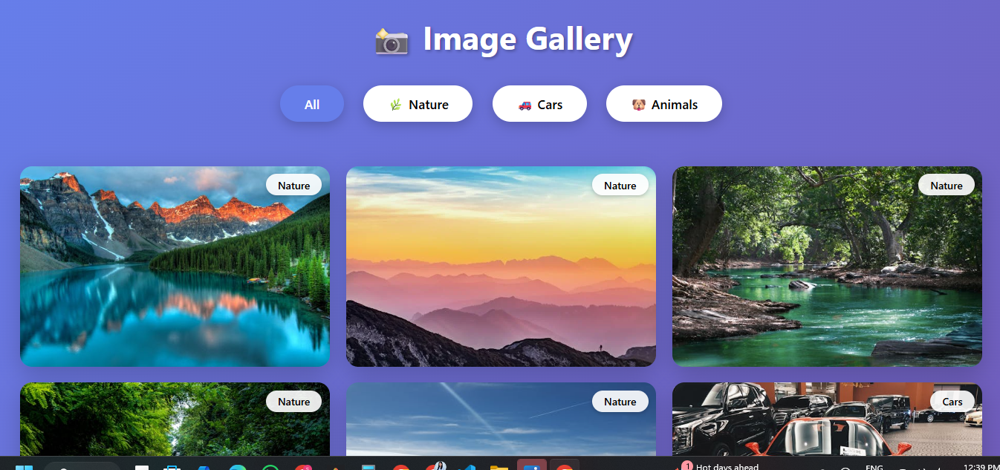
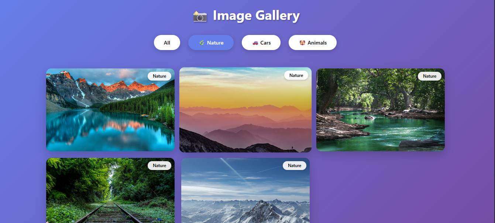
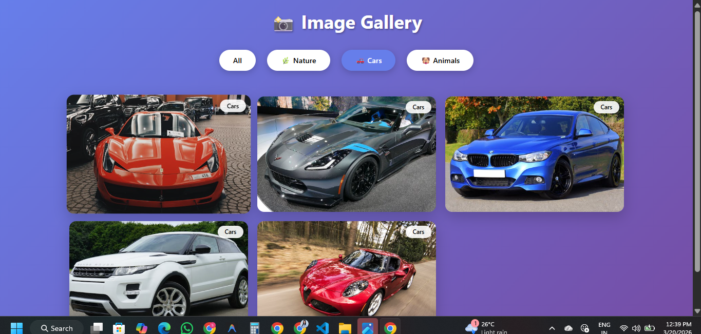
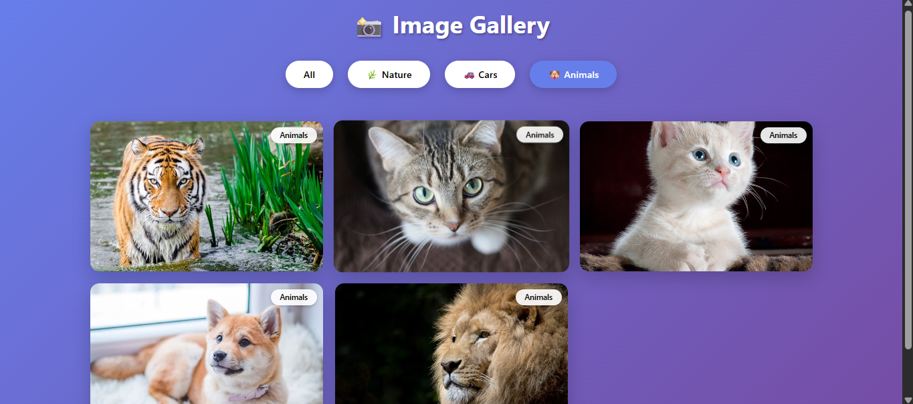

# 🖼️ Image Gallery

A modern and responsive Image Gallery web application built using HTML, CSS, and JavaScript. This project provides a clean and interactive way to display and view images with a smooth user experience.

---

## 🚀 Features

* 🖼️ Responsive Image Grid Layout
* 🔍 Image Preview / Lightbox View
* ✨ Smooth Hover Effects
* 📱 Mobile-Friendly Design
* ⚡ Fast and Lightweight
* 🎨 Clean and Modern UI

---

## 🛠️ Technologies Used

* HTML5
* CSS3
* JavaScript

---

## 📂 Project Structure

```
Image-Gallery/
│── index.html
│── style.css
│── script.js
│── /images
```

---

## 📸 Preview

<p align="center">
  
</p>

<p align="center">
  
</p>

<p align="center">
  
</p>

<p align="center">
  
</p>

---

## 🔗 Live Demo

👉 https://image-gallery-smriti.netlify.app/

---


## 📢 Internship Task

This project is created as part of the CodeAlpha Internship Program.

---

## 🙌 Acknowledgement

Inspired by modern gallery UI designs.


